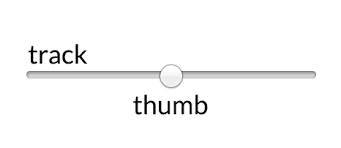

= Styling and scripting sliders — ppk
:author: Peter-Paul Koch
:date: 2015/11
:url: https://www.quirksmode.org/blog/archives/2015/11/styling_and_scr.html

I'm currently working on my first real paid coding project in ages: http://pvdapp.nl/[PvdApp], a project of a friend of mine. (He paid for this research, so he deserves a link.)

Among other things, this project requires me to style and script  sliders. There are several interesting points I would like to bring to  your attention, such as a few underreported IE problems, the solution to Android WebKit's appearance bug, and the proper use of the input and  change events. And a quick syntax overview is always useful.

https://www.quirksmode.org/sliders/sliders.html[Here is an example]. In this particular case the users (Dutch Labour party members) are  asked to divide 100 million euros of budget among several departments,  and using sliders here is obviously a good idea. Also, the combined  value of the sliders shouldn't go above 100 (million), so it requires a  bit of scripting.

== Slider, track, and thumb

This is a slider. Technically it's known as an `<input type="range">`, and it is not supported by IE9 and lower.

This is the HTML:

----
<input type="range" min="0" max="5" value="2" step="1">
----

A slider consists of a *track* on which the user drags a *thumb*. Track and thumb can be styled, but not scripted.

// image::https://www.quirksmode.org/blog/pix/slider.jpg[img]

== Styling basics

Styling sliders isn't all that hard. The go-to reference is https://css-tricks.com/styling-cross-browser-compatible-range-inputs-css/[this CSS Tricks article], and it helped me a lot. Still, I discovered a few details that aren't mentioned there. There is http://brennaobrien.com/blog/2014/05/style-input-type-range-in-every-browser.html[another good introductory article] by Brenna O'Brien, where I [.line-through]#stole# borrowed the image above.

Thumb and track are styleable, though the required pseudo-elements are browser-dependent:

* The *thumb* is addressed as `-webkit-slider-thumb`, `-moz-range-thumb`, or `-ms-thumb`.
* The *track* is addressed as `-webkit-slider-runnable-track`, `-moz-range-track`, or `-ms-track`.

Annoyingly, you cannot combine these selectors in one rule, even  though you usually want to give all browsers the same styles (except for margins on the thumb). If a browser finds one selector it doesn't  understand it ignores all of them. So you'll have to repeat yourself or  use a server-side CSS generator.

IE and MS Edge require a transparent `color` and `border-color` on the track, or they will show (parts of) the native track design.  Also, they may need different margins for the thumb than the other  browsers.

In https://www.quirksmode.org/sliders/sliders.html[my example] the thumb is about 40px high. It turns out that the slider as a whole has an irreversible `overflow: hidden` in both Edge and IE, which hides a large part of my thumb. In order to solve it I had to set the `height` of the slider explicitly.

In IE, but not in Edge, the slider as a whole has a padding. Explicitly set `padding: 0` and save yourself a lot of headaches.

I read several times that MS Edge is supposed to support the `-webkit-` properties. Although this appears to be partially true, it is not  possible to work with one set of styles for both Edge and WebKit/Blink. I advise you to use separate `-ms-` styles; not least because IE10 and IE11 need them. It's best to define the `-ms-` styles after the `-webkit-` ones: thus `-ms-` has the final say in Edge.

In the WebKit- and Blink browsers the thumb has a default `box-sizing: border-box`; while in all other browsers it's the usual `content-box`. It's best to set the thumb's box-sizing explicitly.

WebKit and Blink also require `-webkit-appearance: none` -- with one exception. See below.

=== CSS template

All these minor issues lead to the following CSS template:

----
input[type=range] {
	-webkit-appearance: none;
	height: 35px; /* pick your own value */
	padding: 0;	
	/* your slider styles */
}

input[type=range]::-webkit-slider-thumb {
	-webkit-appearance: none;
	box-sizing: content-box;
	/* your thumb styles */
}

input[type=range]::-moz-range-thumb {
	/* again your thumb styles */
}

input[type=range]::-ms-thumb { /* should come after -webkit- */
	/* again your thumb styles */
	/* may require different margins */
}

input[type=range]::-webkit-slider-runnable-track {
	/* your track styles */
}

input[type=range]::-moz-range-track {
	/* again your track styles */
}

input[type=range]::-ms-track { /* should come after -webkit- */
	border-color: transparent;
	color: transparent;
	/* again your track styles */
}
----

== appearance and an Android WebKit bug

One additional wrinkle in the WebKit- and Blink-based browsers is that you must set `-webkit-appearance: none` on the slider as a whole and on the thumb (though not, oddly, on the track). The template CSS above does so.

Sounds simple enough. The real problem is that *Android WebKit requires you NOT to use* this declaration. If you add `-webkit-appearance: none` Android WebKit doesn't show your styles very well. Removing the  declaration fixes this -- but then the slider isn't styled in Safari,  Chrome, and a host of browsers nobody but me ever tests in.

You will be happy to hear that I was in a brilliant mood this weekend and solved the issue for you. Here it goes.

We set `-webkit-appearance: none` in CSS; that's the only future-friendly solution. In Android WebKit we want to change the value to `slider-horizontal`. But how do we know if we're in Android WebKit?

A browser detect? That simply isn't done in our circles -- and a good  thing, too: it would misfire in Xiaomi Chromium 34 (or 35), which is a  Chromium and thus needs `none`, but disguises itself as Android WebKit for reasons known only to a few deep minds far behind the Great Chinese Firewall.

My original plan was to access the thumb's styles and see if they  match mine. If they don't match something is wrong and we deploy `slider-horizontal`. So let's see:

----
window.getComputedStyle(slider,'::-webkit-slider-thumb').height;
----

Turns out this always gives you the default styles; and not the  styles you wrote so laboriously. More in general, scripts that try to do something with track or thumb have a tendency not to work.

Then [.line-through]#brilliance# dumb luck struck: I saw that  this use of getComputedStyle() isn't supported in Android WebKit. No  styles are returned, not even the default ones.

So I wrote a classic *hack* that uses one bug to defeat another, unrelated one. Fortunately it's a *safe* hack, since both bugs only occur in Android WebKit, and that browser  isn't being developed any more. The current state of affairs won't  change.

----
var testAndWK = window.getComputedStyle(slider,'::-webkit-slider-thumb').height;
if (!testAndWK) {
	slider.style.WebkitAppearance = 'slider-horizontal';
}
----

You can run the test once and use the results for each slider. It  doesn't matter which CSS property you test for, provided it actually  exists. If no value is returned we set `-webkit-appearance: slider-horizontal` on every slider. Problem solved. Even better, the other browsers ignore us while we mumble some `-webkit-` dialect.

== Filling the track progress

In https://www.quirksmode.org/sliders/sliders.html[my example] the track to the left of the thumb has to have another background  colour than the track to the right. IE/Edge and Firefox offer  pseudo-elements for this; WebKit and Blink don't. This does the trick in all IEs, Firefoxes, and Edge:

----
input[type=range]::-ms-fill-lower {
	background-color: #5082e0;	
}

input[type=range]::-moz-range-progress {
	background-color: #5082e0;	
}
----

As to the WebKit- and Blink-based browsers, they require a JavaScript solution. I borrowed mine from https://codepen.io/thebabydino/pen/jEXjVE[Ana Tudor's gorgeous examples]. It uses a https://www.quirksmode.org/css/images/gradients_desktop.html[linear gradient] with a color stop calculated from the slider's current value. See https://www.quirksmode.org/sliders/sliders.js[the script], especially handleSlider().

== Tooltips

Ana also shows how you can use a `:before` pseudo-element  as a styled tooltip that contains the current value. Unfortunately it  turns out that IE/Edge and Firefox don't support `:before` or `:after` in this case, and in fact they're being standards compliant here.  IE/Edge has a native tooltip (see below), but it's impossible to do  tooltips well in Firefox.

I tried a moving element that reacts to the sliding of the thumb, but scripting doesn't work and it's impossible to get the current  coordinates of the thumb. I tried to use the slider's current value to  stand in for the coordinates, but with poor results. In the end we  decided to use a static tooltip (that doesn't really look like a  tooltip).

IE/Edge has a rather boxy native tooltip that's mostly unstyleable. Fortunately you can hide it:

----
input[type=range]::-ms-tooltip {
	display: none;
}
----

== The input and change events

When the user slides the thumb over the track, sliders may fire input and/or change event. Some browsers fire events continuously throughout  the sliding, others only when the sliding stops. Since this was a  commercial project and the solution we needed was fairly obvious from  the start, I did not take detailed compatibility notes.

When monitoring user actions on a slider, listen to both the input  and the change events, and trigger the event handler when the user stops sliding. This gives a consistent result across browsers.

----
slider.addEventListener('input',startTimer,false);
slider.addEventListener('change',startTimer,false);

var timeout;
function startTimer() {
	var that = this;
	clearTimeout(timeout);
	timeout = setTimeout(function () {
		handleEvent(that);
	},100);
}

function handleEvent(slider) {
	/* Fires when user doesn't slide for 100ms */
	...
}
----

Although reliably monitoring every single pixel of sliding is  possible in some browsers, it seems other browsers don't support it at  all. Besides, it would be a resource hog, especially on mobile. But I'd  be happy to be proven wrong on both counts.
