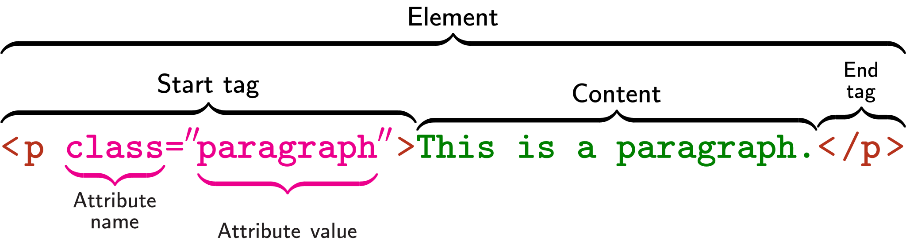

= HTML
:toc: left

.Examplar HTML Element

include::./sections/elements.adoc[leveloffset=+1]

include::./sections/tags.adoc[leveloffset=+1]

include::./sections/attributes.adoc[leveloffset=+1]

include::./sections/entity_names.adoc[leveloffset=+1]

include::./sections/forms.adoc[leveloffset=+1]

include::./sections/iframe.adoc[leveloffset=+1]

include::./sections/accessibility.adoc[leveloffset=+1]