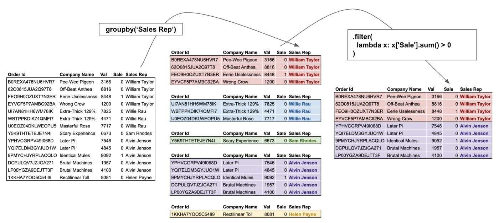

= Pan[el] Da[ta]
:toc: left
:url-website: https://pandas.pydata.org/
:url-pypi: https://pypi.org/project/pandas/
:url-github: https://github.com/pandas-dev/pandas
:url-docs: https://pandas.pydata.org/docs/

{url-website}[[website\]]
{url-pypi}[[pypi\]]
{url-github}[[github\]]
{url-docs}[[docs\]]

== Installation

[source,python]
----
python -m pip install pandas
----

include::./sections/series.adoc[leveloffset=+1]

include::./sections/dataframe.adoc[leveloffset=+1]

== Split, Apply, Combine

image::./res/groupby_apply.png[]

image::./res/groupby_transform.png[]

image::./res/split_apply_combine.png[]

include::./sections/groupby/index.adoc[leveloffset=+1]