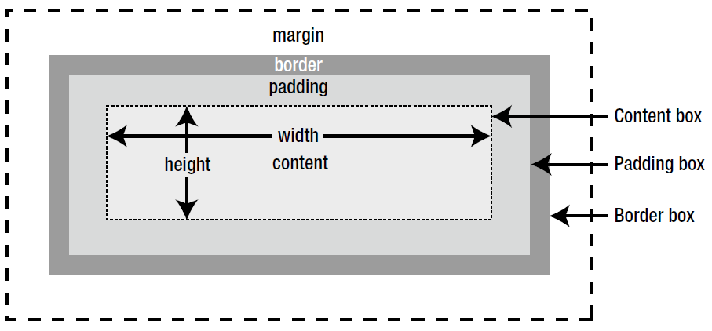

= Cascading Style Sheets (CSS)

.Box Model

[source,css]
----
/* comment */

selector
{
    property: value;
    property: value;
}
----

== Lint

____
"a static code analysis tool used to flag programming errors" -- https://en.wikipedia.org/wiki/Lint_(software)
____

http://csslint.net/

https://github.com/CSSLint/csslint

== Atomic CSS

https://www.smashingmagazine.com/2013/10/challenging-css-best-practices-atomic-approach/

____
"Atomic CSS is the approach to CSS architecture that favors small, single-purpose classes with names based on visual function." --
____

[source,css]
----
.bgr-blue
{
  background-color: #357edd;
}
----

____
"The term "`Atomic CSS`" was coined by Thierry Koblenz in his foundational article https://www.smashingmagazine.com/2013/10/challenging-css-best-practices-atomic-approach/["`Challenging CSS Best Practices`"] in October 2013." -- https://css-tricks.com/lets-define-exactly-atomic-css/
____

== Object Oriented CSS (OOCSS)

include::./sections/media_queries.adoc[leveloffset=+1]

include::./sections/selectors.adoc[leveloffset=+1]