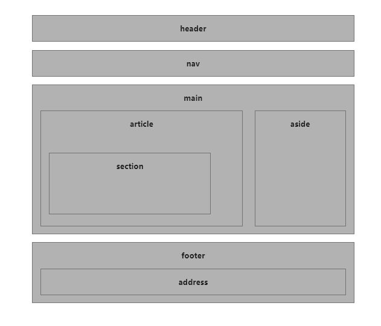

= HTML
:toc: left

https://www.javatpoint.com/html-tags

https://developer.mozilla.org/en-US/docs/Web/HTML/Element

* `
`: 
* ``: 

== Semantic Elements

> "A semantic Web allows data to be shared and reused across applications, enterprises, and communities." -- W3C

Examples:

* non-semantic elements: `
` or ``
* semantic elements: `<form>`, `<table>`, or `<article>`

* `<article>`

* `<aside>`

* `
`

* `<figcaption>`

* `<figure>`

* `<footer>`

* `<header>`

* `<main>`

* `<mark>`

* `<nav>`

* `<section>`

* `
`

* `<time>`

== Tags

.Tags
[%header,separator=,,cols="<m,<m,<,<"]
,===
include::./res/tags.csv[]
,===

== HTML5 Entity Names

https://www.w3schools.com/charsets/ref_html_entities_r.asp

include::./sections/forms.adoc[leveloffset=+1]